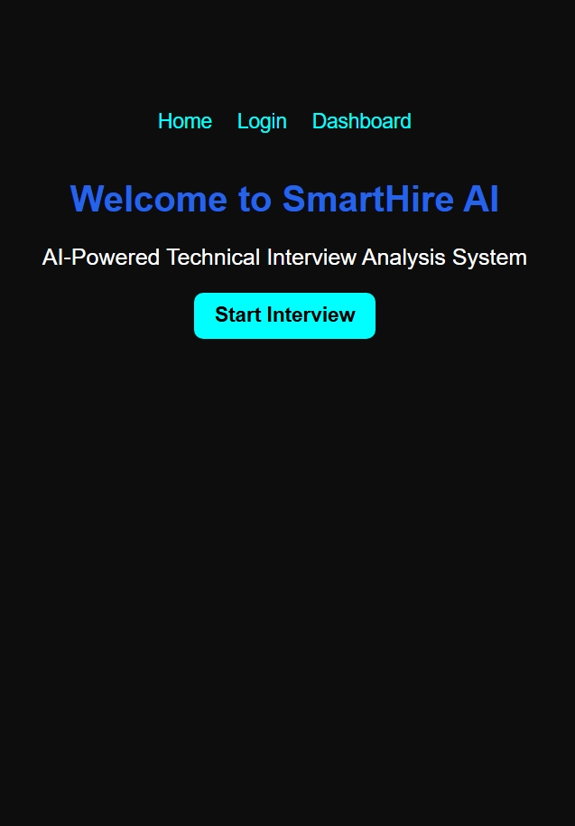

# 🚀 SmartHire AI

SmartHire AI is a web-based recruitment and coding assessment platform developed using **Python**, **Flask**, and **SQLite**.

## ✨ Features

* 👤 User Registration and Login
* 🔐 Session-Based Authentication
* 📷 Face Verification Before the Coding Test
* 💻 Online Coding Assessment
* ⏱️ Timer-Based Examination
* 📊 Automatic Score Calculation
* 🏆 Leaderboard and Top Performer Tracking
* 📄 PDF Report Generation
* 📈 Excel Export of Results
* 🔍 Admin Dashboard with Candidate Search
* 🚪 Logout Functionality

## 🛠️ Technologies Used

* Python
* Flask
* SQLite
* HTML
* CSS
* JavaScript

## ▶️ How to Run

1. Clone this repository.
2. Install the required Python packages.
3. Run:

```bash
python app.py
```

4. Open:

```
http://127.0.0.1:5000
```

## 📁 Project Structure

```text
SmartHireAI/
├── app.py
├── templates/
├── static/
├── screenshots/
├── smarthire.db
└── README.md
```

## 👨‍💻 Developer

**Rajesh Vulla**

* MCA Student
* Python & Flask Developer
* Aspiring Software Engineer

## 📌 Future Enhancements

* Password hashing for improved security
* AI-powered face recognition
* Email notifications
* Multiple coding assessments
* Cloud deployment
* Enhanced analytics dashboard

## 📸 Project Screenshots

### 🏠 Home Page


